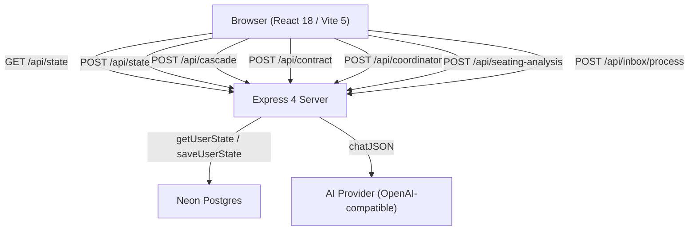

# Design Document — VowsOS

## Overview

VowsOS is built as a direct in-place expansion of the Cadence codebase. No new dependencies are introduced. The existing patterns (flat JSON blob persisted to Neon via `POST /api/state`, view switching via `useState` in `App.jsx`, pure CSS design system in `styles.css`) are preserved and extended.

The expansion adds seven new top-level views, grows the navigation from 3 to 10 items, extends the flat state blob with six new top-level collections, and adds four new Express API routes. All new React code matches the existing component idioms: functional components, hooks-only state, no external state library, inline styles supplemented by the shared CSS classes.

### Key Design Decisions

- **Zero new npm dependencies.** Drag-and-drop uses the HTML5 Drag API. The infinite canvas uses CSS `transform: translate/scale` with pointer events. Property-based testing uses the existing test toolchain.
- **Single state blob.** Adding new collections (guests, budgetCategories, seatingTables, inboxThreads, tasks, contractAnalyses) to the existing flat JSON object keeps the persistence layer unchanged — the same `POST /api/state` endpoint handles everything.
- **Navigation grows from 3 → 10 items** by extending the `NAV` array in `App.jsx` and adding corresponding view renders. No router library is needed.
- **ContractAnalysis association**: The existing contract flow saves a `contractAnalysis` object keyed by `vendorId` in the state blob, making it available to the Vendor Profile Contract tab without any schema migration.

---

## Architecture



### Data Flow

1. On authenticated load, `App.jsx` calls `getState(userId)` → server reads the JSON blob from Neon and returns it.
2. Every user action that mutates data calls `persist(nextState)` → `setData(next)` (optimistic UI) + `saveState(userId, next)` (background POST).
3. AI endpoints receive a subset of the state blob as context, return structured JSON, and the client merges results back into state before calling `persist`.

---

## Components and Interfaces

### File Structure (new files only)

```
src/
  views/
    Budget.jsx          — Requirement 8
    Guests.jsx          — Requirement 9
    Vendors.jsx         — Requirement 3 (expanded from CommandCenter)
    Seating.jsx         — Requirement 10
    Inbox.jsx           — Requirement 6
    AICoordinator.jsx   — Requirement 5
  components/
    Modal.jsx           — (existing, unchanged)
    SkeletonLoader.jsx  — shared skeleton block component
    MutationBlock.jsx   — approve/reject AI mutation card
    VendorProfile.jsx   — tabbed vendor detail panel
    SeatingCanvas.jsx   — infinite canvas + table/badge rendering
    GuestBadge.jsx      — draggable guest pill
    SeatingTable.jsx    — draggable table shape

server/
  prompts.js            — (existing, extended with coordinator/seating/inbox prompts)

api/
  coordinator.js        — POST /api/coordinator route handler
  seating.js            — POST /api/seating-analysis route handler
  inbox.js              — POST /api/inbox/process route handler
```

### Navigation Expansion

`App.jsx` NAV array grows from 3 → 10:

```js
const NAV = [
  { id: 'home',        label: 'Dashboard',       icon: '⌂' },
  { id: 'timeline',    label: 'Timeline',         icon: '◷' },
  { id: 'budget',      label: 'Budget',           icon: '$' },
  { id: 'guests',      label: 'Guests',           icon: '♡' },
  { id: 'vendors',     label: 'Vendors',          icon: '◈' },
  { id: 'contracts',   label: 'Contracts',        icon: '✦' },
  { id: 'seating',     label: 'Seating',          icon: '⊞' },
  { id: 'inspiration', label: 'Inspiration',      icon: '✧' },
  { id: 'inbox',       label: 'Inbox',            icon: '✉' },
  { id: 'ai',          label: 'AI Coordinator',   icon: '◉' },
]
```

Each view renders as `{view === 'budget' && <Budget data={data} persist={persist} />}` etc., matching the existing pattern in `App.jsx`.

### SkeletonLoader Component

A single reusable component that renders animated placeholder blocks:

```jsx
// src/components/SkeletonLoader.jsx
// Props: lines (number, default 3), height (px, default 16)
// Renders <div className="skeleton-line" /> × lines
// CSS: shimmer animation via background-position keyframe
```

### MutationBlock Component

Embedded inside AICoordinator AI message bubbles. Receives a `proposal` object and `onApprove` / `onReject` callbacks:

```jsx
// src/components/MutationBlock.jsx
// Props: proposal { summary, changes: [{field, from, to}] }, onApprove, onReject, applied
// Renders a bordered card with change list and two action buttons
// Once applied=true, shows "Applied" state and disables buttons
```

### VendorProfile Component

Slide-over panel (fixed right, z-index 40) with six tabs. Receives a `vendor` object and the full `data` blob:

```jsx
// src/components/VendorProfile.jsx
// Tabs: Profile | Contract | Emails | Timeline | AI Summary | Open Tasks
// Each tab renders a sub-section reading from data.{contractAnalyses, inboxThreads, timeline, tasks}
```

### SeatingCanvas Component

Manages the infinite canvas state (pan offset + zoom scale) and renders all `seatingTables` from state. Uses `onPointerDown` / `onPointerMove` / `onPointerUp` for panning and `CSS transform: translate(${pan.x}px, ${pan.y}px) scale(${zoom})` on the inner container.

### Drag-and-Drop Strategy (HTML5 Drag API, zero new deps)

**Timeline drag-and-drop:**
- Each `tl-item` gets `draggable={!event.locked}` and `onDragStart` storing the event id in `dataTransfer`.
- Each drop zone row gets `onDragOver` (preventDefault to allow drop) and `onDrop` which reads the id, calculates new time based on drop target position, and calls `persist`.

**Seating Canvas drag-and-drop:**
- `SeatingTable` components use `onPointerDown` to begin dragging (pointer capture via `setPointerCapture`), `onPointerMove` to update position in local state, `onPointerUp` to commit to global state via `persist`.
- `GuestBadge` pills inside tables use the HTML5 Drag API: `draggable`, `onDragStart` (stores `guestId`), and each `SeatingTable` has `onDrop` to handle reassignment.
- Pointer events are used for table movement (smoother on canvas) and HTML5 drag for badge-to-table (works cross-container).

### Infinite Canvas Strategy

The canvas container is `overflow: hidden; position: relative` with a fixed viewport height. Inside is a single `div.canvas-world` with `position: absolute; transform-origin: 0 0; transform: translate(${pan.x}px, ${pan.y}px) scale(${zoom})`. 

- **Panning**: `onPointerDown` on the canvas background (not on a table) sets `isPanning=true`, `onPointerMove` updates `pan` offset.
- **Zooming**: `onWheel` updates `zoom` (clamped 0.3–2.0), adjusting the transform origin to zoom toward the cursor.
- **Grid background**: CSS `background-image: radial-gradient(circle, var(--line) 1px, transparent 1px); background-size: 28px 28px` on the canvas container, which stays fixed while the world div pans.

---

## Data Models

### Extended State Blob

The existing `emptyState()` in `server/data.js` is extended with six new top-level collections:

```js
// server/data.js — emptyState() additions
{
  // existing
  wedding: { couple, date, dateLabel, venue, guestCount, budgetTotal, budgetSpent, sunset },
  vendors: [],     // existing
  timeline: [],    // existing
  payments: [],    // existing
  alerts: [],      // existing

  // new
  guests: [],
  budgetCategories: [],
  seatingTables: [],
  inboxThreads: [],
  tasks: [],
  contractAnalyses: {},   // keyed by vendorId: { vendorId, analysis: ContractAnalysis }
}
```

### Guest

```js
{
  id: string,           // uid()
  name: string,
  rsvp: 'confirmed' | 'declined' | 'awaiting',
  meal: string,         // free text or enum: 'chicken' | 'fish' | 'vegan' | 'kids' | ''
  gift: string,
  relationship: string, // 'family' | 'friends' | 'coworkers' | 'other'
  lodging: 'needed' | 'arranged' | 'none',
  transport: boolean,
  notes: string,
  tableId: string | null,  // assigned SeatingTable id
}
```

### BudgetCategory

```js
{
  id: string,
  name: string,
  projected: number,    // dollars
  actual: number,       // dollars
  dueDate: string,      // YYYY-MM-DD or ''
  invoiceRef: string,   // filename or URL, '' if none
  vendorId: string,     // optional link to a vendor
}
```

### SeatingTable

```js
{
  id: string,
  label: string,        // "Table 1", "Sweetheart Table", etc.
  shape: 'round' | 'rect',
  capacity: number,
  x: number,            // canvas position px
  y: number,
  width: number,        // px
  height: number,
  guestIds: string[],   // ordered seat assignments
}
```

### InboxThread

```js
{
  id: string,
  vendorId: string,     // matched vendor id or ''
  sender: string,
  subject: string,
  receivedAt: string,   // ISO timestamp
  body: string,
  tldr: string,         // AI-generated
  impact: string,       // AI-generated impact description
  impactLevel: 'high' | 'medium' | 'low' | 'none',
  replies: [{ sentAt: string, body: string }],
}
```

### Task

```js
{
  id: string,
  description: string,
  checked: boolean,
  vendorId: string | null,   // optional vendor link
  dueDate: string,
}
```

### ContractAnalysis (existing shape, now persisted)

```js
// contractAnalyses is a map keyed by vendorId
contractAnalyses: {
  [vendorId]: {
    vendorId: string,
    scannedAt: string,        // ISO timestamp
    vendorName: string,
    category: string,
    payments: [{ label, amount, dueDate }],
    hiddenFees: [{ label, detail, amount }],
    gratuityIncluded: boolean | 'unclear',
    cancellation: string,
    keyDates: [{ label, date }],
    watchOuts: string[],
  }
}
```

### AI Coordinator Message

Not persisted to DB — lives in component local state only:

```js
{
  id: string,
  role: 'user' | 'assistant',
  content: string,
  proposal: MutationProposal | null,  // non-null when assistant suggests changes
  applied: boolean,
}

// MutationProposal
{
  summary: string,
  targetCollection: 'timeline' | 'vendors' | 'budget' | 'guests' | 'payments',
  changes: [{ field: string, recordId: string, from: any, to: any }],
  rawPatch: object,   // the full merged-in patch to apply to state
}
```

---

## Correctness Properties


*A property is a characteristic or behavior that should hold true across all valid executions of a system — essentially, a formal statement about what the system should do. Properties serve as the bridge between human-readable specifications and machine-verifiable correctness guarantees.*

### Property 1: Active nav item has active class

*For any* navigation item id, when the current view is set to that id, the corresponding nav element should carry the `active` CSS class and no other nav element should.

**Validates: Requirements 1.3**

---

### Property 2: Alert row appears for every triggering payment

*For any* state containing payments, an alert row should be rendered for every payment that either has `status === 'action'` or has a due date within 14 calendar days with a non-paid status, and no alert row should appear for payments that meet neither condition.

**Validates: Requirements 2.3, 2.4**

---

### Property 3: Task checked state round-trip

*For any* task in the tasks collection, toggling `checked` to `true` and calling persist should result in the stored state having `checked === true` for that task id. Toggling back to `false` should restore `checked === false`.

**Validates: Requirements 2.7**

---

### Property 4: Countdown displays correct day difference

*For any* wedding date string, the countdown value rendered in the Dashboard should equal the integer result of `Math.round((weddingDate - today) / 86400000)`.

**Validates: Requirements 2.1**

---

### Property 5: Vendor tab content filtered by vendorId

*For any* vendor and any tab (Contract, Emails, Timeline, AI Summary, Open Tasks), the items rendered in that tab should all have `vendorId` matching the selected vendor's id. No items belonging to a different vendor should appear.

**Validates: Requirements 3.3, 3.4, 3.5, 3.6, 3.7, 3.8**

---

### Property 6: Vendor profile edit round-trip

*For any* vendor and any field update on the Profile tab, saving the change should produce a state where `vendors.find(v => v.id === vendor.id)[field]` equals the new value.

**Validates: Requirements 3.9**

---

### Property 7: Contract validation rejects short input

*For any* string of length fewer than 50 characters (including empty string and whitespace-only strings), submitting it to the Contract Analysis Engine should be rejected without making a server call, and the `contractAnalyses` state should be unchanged.

**Validates: Requirements 4.5**

---

### Property 8: Contract analysis association round-trip

*For any* contract scan result with a matched `vendorId`, after the user saves the analysis, `state.contractAnalyses[vendorId]` should contain the extracted `ContractAnalysis` data, making it accessible to the Vendor Profile Contract tab.

**Validates: Requirements 4.6**

---

### Property 9: ContractAnalysis serialization round-trip

*For any* valid `ContractAnalysis` object, printing it to a structured summary string and then parsing that string should produce a `ContractAnalysis` object equivalent to the original (same vendor name, same payment count, same payment amounts and labels).

**Validates: Requirements 4.7, 4.8, 4.9**

---

### Property 10: AI message alignment by role

*For any* list of chat messages, every message with `role === 'user'` should render with the `chat-msg-user` class (right-aligned), and every message with `role === 'assistant'` should render with the `chat-msg-ai` class (left-aligned).

**Validates: Requirements 5.2**

---

### Property 11: MutationBlock rendered for proposals

*For any* AI message with a non-null `proposal` field, the rendered message should contain a MutationBlock component with Approve and Reject buttons. Messages without a proposal should not render a MutationBlock.

**Validates: Requirements 5.3**

---

### Property 12: Mutation approve applies changes; reject leaves state unchanged

*For any* `MutationProposal`, clicking Approve should produce a state that reflects `rawPatch` merged into the relevant collection. Clicking Reject on any proposal should leave the state byte-for-byte identical to the state before the proposal was shown.

**Validates: Requirements 5.4, 5.5**

---

### Property 13: Failed AI request does not mutate state

*For any* application state, if the AI Coordinator API call returns an error response, the state after the failed call should be strictly equal (deep equality) to the state before the call.

**Validates: Requirements 5.8**

---

### Property 14: InboxThread list item contains required fields

*For any* `InboxThread`, the rendered list item should contain the sender name, a formatted `receivedAt` timestamp, and the `tldr` string. All three must be non-empty for a processed thread.

**Validates: Requirements 6.2**

---

### Property 15: Thread impact banner reflects impact field

*For any* `InboxThread` with a non-empty `impact` string, the detail pane rendered for that thread should display the impact text. The `impactLevel` value should correspond to the visual severity styling applied.

**Validates: Requirements 6.4**

---

### Property 16: Reply send round-trip

*For any* `InboxThread`, after the user sends a reply, `thread.replies` should contain exactly one more entry than before, and the last entry's `body` should equal the sent text.

**Validates: Requirements 6.6**

---

### Property 17: Inbox processing produces non-empty tldr and impact

*For any* email body submitted to the inbox processing endpoint, the returned object should have a `tldr` string of at least one character and an `impact` string of at least one character.

**Validates: Requirements 6.7**

---

### Property 18: Locked events are not draggable

*For any* `TimelineEvent` with `locked === true`, the rendered card should have `draggable={false}`. For any event with `locked === false`, it should have `draggable={true}`.

**Validates: Requirements 7.1, 7.6**

---

### Property 19: Timeline sorted by time after any drag

*For any* timeline state after a drag-drop reorder operation, the `timeline` array in state should be sorted in ascending order by the `minutes` field.

**Validates: Requirements 7.3**

---

### Property 20: Overlapping events produce conflict indicators

*For any* pair of `TimelineEvent` objects where `eventA.minutes + eventA.durationMin > eventB.minutes` (i.e. their time ranges overlap), both events should render with a conflict indicator.

**Validates: Requirements 7.4**

---

### Property 21: Budget table has one row per category

*For any* `budgetCategories` array, the rendered Budget table should have exactly `budgetCategories.length` data rows.

**Validates: Requirements 8.2**

---

### Property 22: Over-budget alert for any exceeded category

*For any* `BudgetCategory` where `actual > projected`, an alert banner identifying that category should be displayed. Categories where `actual <= projected` should not trigger this alert.

**Validates: Requirements 8.3**

---

### Property 23: Budget totals are always arithmetically correct

*For any* `budgetCategories` array, the Amount Spent value displayed should equal `sum(category.actual)` and the Amount Remaining value should equal `wedding.budgetTotal - sum(category.actual)`, regardless of which categories were most recently edited.

**Validates: Requirements 8.7**

---

### Property 24: Total projected over budget triggers warning

*For any* state where `sum(budgetCategory.projected) > wedding.budgetTotal`, a total-budget-exceeded warning should be displayed. When the sum is ≤ budgetTotal, no warning should appear.

**Validates: Requirements 8.8**

---

### Property 25: Guest grid has one row per guest

*For any* `guests` array, the rendered Guest Management grid should have exactly `guests.length` data rows.

**Validates: Requirements 9.1**

---

### Property 26: Guest aggregate counts are always correct

*For any* `guests` array, the displayed aggregate counts should satisfy: confirmed = guests where rsvp='confirmed', declined = guests where rsvp='declined', awaiting = guests where rsvp='awaiting', total = guests.length. These must hold after every add, edit, and bulk update.

**Validates: Requirements 9.5**

---

### Property 27: Guest filter does not destroy underlying data

*For any* filter applied to the guest grid, the number of visible rows should be ≤ total guests. After clearing the filter, all guests should be visible again. The `guests` array in state should have the same length before and after filtering.

**Validates: Requirements 9.6**

---

### Property 28: Empty guest name is rejected

*For any* Guest Name submission where the trimmed name string is empty, the App should display an inline validation error and the `guests` array in state should remain unchanged.

**Validates: Requirements 9.7**

---

### Property 29: Guest appears in exactly one table

*For any* valid seating state, each `guestId` should appear in at most one `SeatingTable.guestIds` array. If a guest id appears in two or more tables simultaneously, a conflict indicator should be shown on both GuestBadge instances.

**Validates: Requirements 10.5, 10.8**

---

### Property 30: SeatingTable position persisted after drag

*For any* SeatingTable drag operation that ends at position `(x, y)`, the corresponding table record in `state.seatingTables` should have `x` and `y` equal to the drop coordinates after `persist` is called.

**Validates: Requirements 10.3**

---

### Property 31: SkeletonLoader shown during loading, replaced on completion

*For any* async data fetch, the component should render a SkeletonLoader while `loading === true` and render the actual content (with no skeleton) when `loading === false`. The transition between the two states should not require a full page re-render.

**Validates: Requirements 12.1, 12.2**

---

### Property 32: Invalid form submission shows errors and blocks server call

*For any* form submission where required fields fail validation, inline error messages should be rendered adjacent to the invalid fields and no API call should be made.

**Validates: Requirements 12.3**

---

## Error Handling

### Persistence failures (Requirement 11.3)

When `saveState` receives a non-2xx response or a network error, `App.jsx` catches the rejection and:
1. Sets a `saveError` flag in local state.
2. Renders a non-blocking toast notification (fixed bottom-right, auto-dismiss after 5s) with CSS class `toast error`.
3. Retains the in-memory state so no user data is lost.
4. Retries automatically on the next user action that calls `persist`.

### AI endpoint failures

All AI route calls (cascade, contract, coordinator, seating-analysis, inbox/process) follow the existing pattern:
- Server-side: `try { ... return res.json({ ...result, source: 'model' }) } catch (err) { return res.json({ ...fallback(...), source: 'demo' }) }`
- Client-side: `.catch(() => ({ ...fallback, source: 'demo' }))` so the UI never hard-crashes.

### Coordinator-specific error

When the coordinator fetch fails, `AICoordinator.jsx` appends an error message object to the local `messages` array with `role: 'assistant'`, `content: 'Sorry, I ran into an error. Your data was not changed.'`, and `proposal: null`. This satisfies Property 13 (no state mutation on failure).

### Form validation errors

All form fields that require validation render an error string below the field when the validation condition is not met. The submit handler returns early if any required field is invalid, preventing any `persist` call.

### Offline / DB unreachable at load time (Requirement 11.4)

`getState` in `src/api.js` already has a `.catch` that returns `{ ...fullState(), persisted: false }`. A new `offlineWarning` boolean in that fallback response triggers a banner at the top of the workspace.

---

## Testing Strategy

### Dual Testing Approach

Both unit tests and property-based tests are required. They are complementary:
- Unit tests cover specific examples, integration points, and edge cases (the "yes - example" criteria).
- Property-based tests verify universal correctness across many randomly generated inputs (the "yes - property" criteria).

### Property-Based Testing Setup

**Library**: `fast-check` (the standard PBT library for JavaScript/TypeScript ecosystems).

Install: `npm install --save-dev fast-check`

Each property test must:
- Run a minimum of 100 iterations (`fc.assert(fc.property(...), { numRuns: 100 })`).
- Include a comment tag referencing the design property:
  `// Feature: vows-os, Property N: <property text>`
- Cover exactly one design document property per test.

### Unit Test Targets (specific examples and edge cases)

- `Sidebar` renders with authenticated user and shows all 10 nav items (Req 1.1)
- `Sidebar` does not render when user is unauthenticated (Req 1.6)
- `Dashboard` shows placeholder when alerts array is empty (Req 2.8)
- `Dashboard` shows 4 metric cards (Req 2.9)
- `Budget` shows 3 summary metric modules (Req 8.1)
- `Seating` renders canvas with dot-matrix background (Req 10.1)
- `Seating` supports both round and rectangular table shapes (Req 10.2)
- `Seating` slide-out AI Analysis Sidebar renders (Req 10.6)
- Loading gate: data-dependent views are not rendered while state is null (Req 11.2)
- DB write failure shows non-blocking error toast (Req 11.3)
- Offline load fallback triggers connectivity warning (Req 11.4)
- Valid form submit disables submit button until response received (Req 12.4)
- VendorProfile panel opens with 6 tabs on vendor click (Req 3.2)
- Contract view has upload zone and paste area (Req 4.1)
- AI Coordinator shows skeleton loader after message submit (Req 5.7)
- Inbox empty state shows onboarding prompt (Req 6.8)
- Timeline "Execute Auto-Fix" button appears when conflicts are present (Req 7.5)
- CascadeEngine fix requires confirmation before applying (Req 7.7)

### Property Test Targets

Each maps directly to one numbered property in the Correctness Properties section above. Tests live in `src/__tests__/` using a test runner (Vitest, which is already in the Vite ecosystem and requires no extra config beyond installing it).

Key generators needed:
- `fc.record({ id: fc.string(), name: fc.string(), rsvp: fc.constantFrom('confirmed','declined','awaiting'), ... })` for Guest
- `fc.record({ id: fc.string(), projected: fc.float({min:0}), actual: fc.float({min:0}), ... })` for BudgetCategory
- `fc.record({ id: fc.string(), minutes: fc.integer({min:0,max:1439}), durationMin: fc.integer({min:1,max:480}), locked: fc.boolean(), ... })` for TimelineEvent
- `fc.record({ vendorId: fc.string(), vendorName: fc.string(), payments: fc.array(...), ... })` for ContractAnalysis
- `fc.constantFrom('home','timeline','budget','guests','vendors','contracts','seating','inspiration','inbox','ai')` for nav ids
